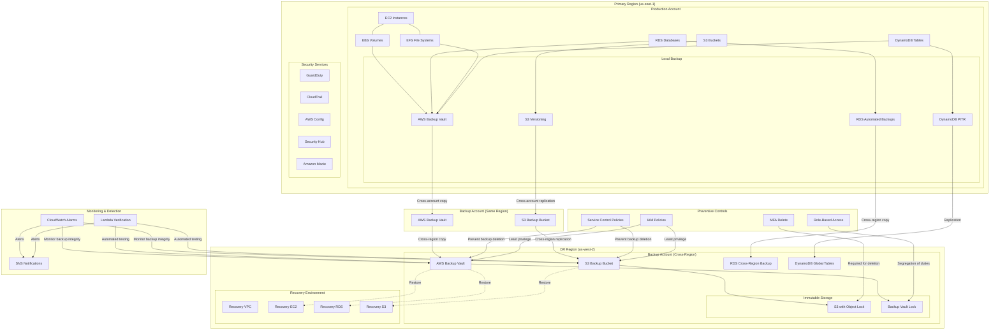
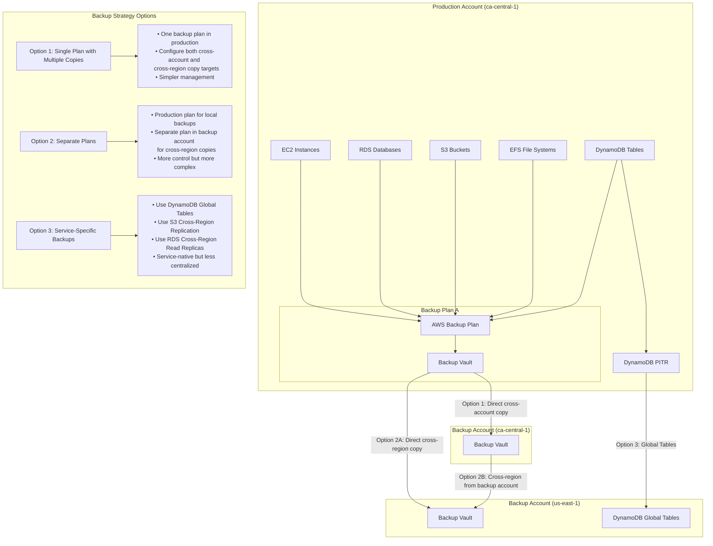

# AWS Ransomware Recovery Strategies for Retail Industry

## Common Ransomware Attack Scenarios in Retail on AWS

### 1. EC2-Hosted POS System Encryption
- **Scenario**: Malware encrypts EC2 instances running POS applications
- **Impact**: Inability to process transactions, complete sales, or access inventory data
- **AWS Services Affected**: EC2, EBS volumes, RDS databases, ElastiCache

### 2. S3-Stored Customer Data Encryption/Exfiltration
- **Scenario**: Ransomware encrypts or exfiltrates customer data stored in S3
- **Impact**: Loss of customer records, potential data breach, compliance violations
- **AWS Services Affected**: S3, DynamoDB, RDS, Aurora

### 3. RDS/Aurora Inventory Database Compromise
- **Scenario**: Ransomware targeting inventory databases in RDS/Aurora
- **Impact**: Inability to track stock, fulfill orders, or manage supply chain
- **AWS Services Affected**: RDS, Aurora, DynamoDB, DocumentDB

### 4. AWS-Hosted E-commerce Platform Attack
- **Scenario**: Web applications on ECS/EKS/EC2 encrypted or defaced
- **Impact**: Loss of online sales channel, customer trust issues
- **AWS Services Affected**: EC2, ECS, EKS, S3, CloudFront, RDS

### 5. AWS Account Compromise
- **Scenario**: Attacker gains access to AWS account and deploys ransomware
- **Impact**: Widespread encryption, resource deletion, credential theft
- **AWS Services Affected**: Multiple services across the account

## Essential AWS Recovery Tools and Technologies

### AWS Backup and Recovery Services
- **AWS Backup**: Centralized backup service for EC2, EBS, RDS, DynamoDB, EFS
- **Amazon S3 Versioning**: Maintains multiple versions of objects for recovery
- **Amazon RDS Automated Backups**: Point-in-time recovery for databases
- **AWS Elastic Disaster Recovery**: Continuous replication for EC2 instances
- **Amazon EBS Snapshots**: Point-in-time copies of EBS volumes

### AWS Security and Forensic Tools
- **Amazon GuardDuty**: Threat detection service for AWS accounts and workloads
- **AWS Security Hub**: Comprehensive security and compliance center
- **Amazon Detective**: Security investigation and analysis
- **AWS CloudTrail**: Track user activity and API usage
- **VPC Flow Logs**: Network traffic capture and analysis

### AWS Isolation and Containment Tools
- **VPC Security Groups**: Instance-level firewall for network isolation
- **Network ACLs**: Subnet-level network access control
- **AWS WAF**: Web application firewall for filtering malicious traffic
- **AWS Shield**: DDoS protection service
- **AWS Firewall Manager**: Centrally configure and manage firewall rules

## AWS Recovery Playbooks and Procedures

### Pre-Recovery Assessment
1. **Identify Attack Scope**:
   - Use AWS Config to identify affected resources
   - Analyze CloudTrail logs for unauthorized actions
   - Review GuardDuty findings for malicious activity
   - Use Amazon Detective to understand the attack path

2. **Establish Recovery Priorities**:
   - POS systems on EC2/ECS
   - Customer-facing applications behind ALB/CloudFront
   - RDS/Aurora databases for inventory and orders
   - Back-office systems on EC2/WorkSpaces

3. **Verify AWS Backup Integrity**:
   - Confirm AWS Backup recovery points are unaffected
   - Verify S3 object versions predate the attack
   - Test sample restoration in isolated VPC
   - Check RDS automated backups for integrity

### Execution Phase
1. **Isolation Protocol**:
   - Create isolation security groups for affected instances
   - Update NACLs to block malicious traffic
   - Use AWS Organizations SCPs to restrict actions
   - Implement emergency IAM policies

2. **Clean Environment Preparation**:
   - Launch new VPC with clean infrastructure
   - Deploy CloudFormation templates for recovery environment
   - Use AWS Control Tower for secure multi-account setup
   - Prepare AMIs and container images for clean deployments

3. **AWS Data Restoration Process**:
   - Restore EC2 instances from AMIs or AWS Backup
   - Recover RDS databases to point-in-time before attack
   - Restore S3 objects from previous versions
   - Recover DynamoDB tables from backups

4. **Staged Recovery Approach**:
   - Recover critical retail operations first (POS EC2 instances, payment processing)
   - Restore customer-facing systems (ALB, CloudFront, API Gateway)
   - Recover non-essential systems last

### Post-Recovery Actions
1. **Verification Procedures**:
   - Use AWS Systems Manager to verify system functionality
   - Run database integrity checks on restored RDS instances
   - Verify CloudWatch alarms and metrics are normal
   - Test application functionality through canary deployments

2. **Enhanced AWS Monitoring**:
   - Deploy additional CloudWatch alarms
   - Enable advanced GuardDuty features
   - Implement AWS Config rules for security compliance
   - Set up CloudTrail Insights for anomaly detection

3. **Documentation and Lessons Learned**:
   - Document recovery timeline and AWS resources used
   - Update AWS Well-Architected security pillar implementation
   - Enhance AWS backup strategies based on experience

## Retail-Specific AWS Database Recovery Patterns

### POS Transaction Database Recovery (RDS/Aurora)
- **Pattern**: Point-in-time recovery with transaction reconciliation
- **AWS Implementation**:
  - Use RDS automated backups for point-in-time recovery
  - Apply AWS DMS to replicate transactions from backup sources
  - Implement Aurora global database for cross-region recovery
  - Use RDS Multi-AZ for high availability during recovery

### Customer Database Protection (DynamoDB/RDS)
- **Pattern**: Segmented backup strategy with encryption
- **AWS Implementation**:
  - Enable DynamoDB point-in-time recovery
  - Use AWS Backup for cross-region backup copies
  - Implement AWS KMS for encryption of sensitive data
  - Use DynamoDB global tables for multi-region resilience

### Inventory Database Recovery (Aurora/RDS)
- **Pattern**: Layered recovery with reconciliation
- **AWS Implementation**:
  - Use Aurora backtrack for quick recovery to previous state
  - Implement Aurora global database for cross-region recovery
  - Use AWS DMS to capture and replay transactions
  - Deploy read replicas for reporting during recovery

## Ensuring AWS Backup Integrity

### Ransomware-Resistant Backup Architecture

### Preventing AWS Backup Compromise
1. **Immutable Storage**:
   - Enable S3 Object Lock for WORM storage
   - Use S3 Versioning with MFA Delete
   - Implement S3 Lifecycle policies for backup retention
   - Use AWS Backup Vault Lock for immutable backups

2. **AWS Access Control Measures**:
   - Implement separate IAM roles for backup administration
   - Use AWS Organizations SCPs to prevent backup deletion
   - Enable MFA for backup management actions
   - Implement cross-account backup access controls

### Multi-Region, Multi-Account Backup Strategy

#### Backup Strategy Implementation Options

1. **Option 1: Single Backup Plan with Multiple Copy Targets**
   - Create one backup plan in the production account
   - Configure both cross-account and cross-region copy targets in the same plan
   - Advantages: Simpler management, single point of configuration
   - Disadvantages: Less granular control over secondary copies

2. **Option 2: Separate Backup Plans**
   - Create a primary backup plan in the production account
   - Create a secondary backup plan in the backup account to copy to other regions
   - Advantages: More control over secondary copies, separate retention policies
   - Disadvantages: More complex management, requires coordination between plans

3. **Option 3: Service-Specific Backup Approaches**
   - Use service-native replication mechanisms alongside AWS Backup
   - Examples:
     - DynamoDB: Global Tables for multi-region replication
     - S3: Cross-Region Replication with replication rules
     - RDS: Cross-Region Read Replicas with promotion capability
   - Advantages: Leverages service-specific features, may offer faster recovery
   - Disadvantages: Less centralized management, inconsistent approach across services

#### DynamoDB Backup Options

1. **AWS Backup for DynamoDB**
   - Integrated with centralized AWS Backup service
   - Supports cross-account and cross-region copies
   - Can be protected with AWS Backup Vault Lock
   - Supports scheduled backups with flexible retention

2. **DynamoDB Point-in-Time Recovery (PITR)**
   - Continuous backups with 35-day retention window
   - Restore to any point in time within the retention period
   - Protects against accidental writes or deletes
   - No additional cost for storage (pay only for restored capacity)

3. **DynamoDB On-Demand Backups**
   - Manual snapshots with indefinite retention
   - Full table backups that don't affect performance
   - Can be copied across regions and accounts
   - Useful for long-term archival needs

4. **DynamoDB Global Tables**
   - Active-active replication across multiple regions
   - Near real-time replication of data
   - Provides both disaster recovery and high availability
   - Can be used as part of a ransomware recovery strategy

#### Best Practices for Multi-Region, Multi-Account Backups

1. **Defense in Depth**
   - Use multiple backup mechanisms for critical data
   - Combine AWS Backup with service-specific features
   - Implement both scheduled backups and continuous replication

2. **Immutability Controls**
   - Apply Vault Lock in the cross-region backup account
   - Use SCPs to prevent backup deletion in the backup account
   - Implement strict IAM permissions for backup access

3. **Testing and Validation**
   - Regularly test restoration from cross-region backups
   - Validate data integrity after restoration
   - Practice recovery scenarios using backup copies

### Complementary RDS Backup Strategies

Using both RDS automated backups and AWS Backup provides a comprehensive defense-in-depth approach:

1. **RDS Automated Backups**:
   - Provide point-in-time recovery (PITR) for up to 35 days
   - Enable transaction log backups for continuous recovery points
   - Allow restoration to any second within the retention period
   - Are automatically enabled by default on RDS instances
   - Support automated backup windows to minimize performance impact

2. **AWS Backup for RDS**:
   - Creates additional snapshot-based backups
   - Enables longer retention periods (months to years)
   - Facilitates cross-account and cross-region copies
   - Can be protected with AWS Backup Vault Lock for immutability
   - Centralizes backup management across multiple services
   - Supports lifecycle policies for cost optimization

3. **Benefits of Dual Approach**:
   - **Defense in Depth**: Two separate backup mechanisms provide redundancy
   - **Recovery Flexibility**: PITR for granular recovery, snapshots for stable recovery points
   - **Comprehensive Protection**: Short-term operational recovery + long-term compliance needs
   - **Centralized Management**: Single dashboard for all backup types
   - **Ransomware Resilience**: Multiple recovery options if one backup type is compromised

4. **Implementation Best Practices**:
   - Configure RDS with 1-35 day retention for operational recovery
   - Use AWS Backup for weekly full snapshots with longer retention
   - Store AWS Backup copies in a separate account with Vault Lock
   - Test both recovery methods regularly as part of DR exercises
   - Implement automated validation of both backup typeslement least privilege access for backup systems

3. **AWS Backup Verification**:
   - Use AWS Lambda for automated backup testing
   - Implement AWS Config rules to verify backup compliance
   - Deploy CloudWatch alarms for backup job failures
   - Use AWS Systems Manager to automate backup verification

### AWS Backup Monitoring and Alerting
1. **Change Rate Monitoring**:
   - Set up CloudWatch alarms for unusual backup size changes
   - Monitor S3 object change rates with CloudTrail
   - Track EBS snapshot creation patterns

2. **Backup Success Verification**:
   - Use AWS Step Functions for backup verification workflows
   - Implement Lambda functions for automated backup testing
   - Deploy CloudWatch dashboards for backup status monitoring

3. **Anomaly Detection**:
   - Use CloudTrail Insights to detect unusual backup activity
   - Implement GuardDuty for threat detection
   - Set up CloudWatch anomaly detection for backup patterns

## Retail Industry AWS Recovery Case Studies

### Case Study 1: Major Department Store Chain on AWS
- **Scenario**: EC2-hosted POS system encryption during holiday season
- **AWS Recovery Approach**: 
  - Deployed EC2 Auto Scaling group with clean AMIs
  - Used AWS Systems Manager for coordinated recovery
  - Restored RDS databases from automated backups
- **Outcome**: Restored operations within 6 hours with minimal sales impact
- **Key Lesson**: Importance of regularly updated AMIs and automated deployment

### Case Study 2: Online Retailer Data Ransom on AWS
- **Scenario**: S3 bucket encryption and DynamoDB table deletion
- **AWS Recovery Approach**: 
  - Restored from S3 Versioning and DynamoDB backups
  - Used AWS CloudTrail to identify compromised credentials
  - Implemented stricter S3 bucket policies and SCPs
- **Outcome**: Recovered customer data without paying ransom
- **Key Lesson**: Value of S3 Versioning and cross-region backups

### Case Study 3: Retail Supply Chain Attack on AWS
- **Scenario**: Aurora database compromise affecting inventory systems
- **AWS Recovery Approach**: 
  - Used Aurora backtrack to quickly restore database state
  - Implemented Aurora Global Database for cross-region resilience
  - Deployed enhanced VPC security groups and NACLs
- **Outcome**: Minimized business impact through rapid database recovery
- **Key Lesson**: Importance of database-specific recovery features in AWS

## AWS-Specific Ransomware Prevention Measures

### Identity and Access Management
- Implement AWS IAM best practices with least privilege
- Use AWS Organizations SCPs to prevent destructive actions
- Enable MFA for all IAM users, especially privileged accounts
- Implement AWS IAM Access Analyzer to identify unintended access

### Data Protection
- Enable S3 Versioning and Object Lock for critical data
- Use AWS Backup for centralized, automated backups
- Implement cross-region and cross-account backup copies
- Enable EBS, RDS, and DynamoDB point-in-time recovery

### Detection and Response
- Deploy Amazon GuardDuty for threat detection
- Use AWS Security Hub for security posture management
- Implement AWS Config rules for compliance monitoring
- Set up CloudWatch alarms for suspicious activity

### Network Security
- Implement VPC security groups and NACLs for network isolation
- Use AWS WAF to protect web applications
- Deploy AWS Shield for DDoS protection
- Implement AWS Network Firewall for enhanced network security

## Conclusion

Successful ransomware recovery for retail workloads on AWS requires:

1. **AWS-Native Backup Solutions**: Utilizing S3 Versioning, RDS automated backups, and AWS Backup
2. **Isolation Capabilities**: Using VPCs, security groups, and NACLs to contain incidents
3. **Rapid Recovery Automation**: Implementing CloudFormation, Systems Manager, and Auto Scaling for quick recovery
4. **Cross-Region Resilience**: Leveraging global tables, cross-region replication, and multi-region architectures
5. **Comprehensive Monitoring**: Using GuardDuty, CloudTrail, and Security Hub for detection and forensics

By implementing these AWS-specific strategies, retail organizations can recover from ransomware attacks without paying ransoms, while minimizing operational and financial impacts.
