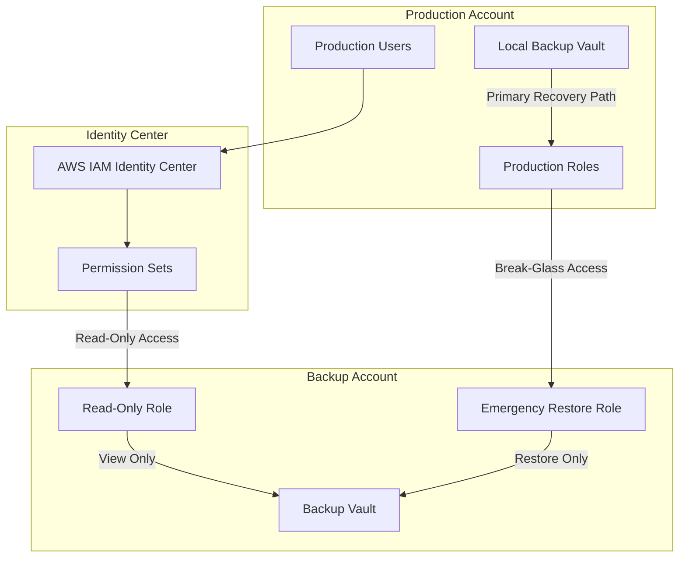
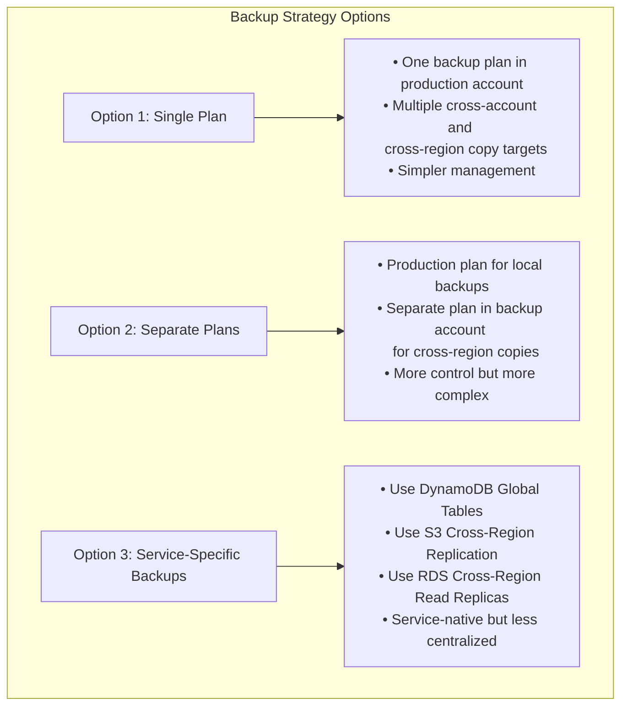

#### Backup Strategy Implementation Options

1. **Option 1: Single Backup Plan with Multiple Copy Targets**
   - Create one backup plan in the production account
   - Configure both cross-account and cross-region copy targets in the same plan
   - Advantages: Simpler management, single point of configuration
   - Disadvantages: Less granular control over secondary copies

2. **Option 2: Separate Backup Plans**
   - Create a primary backup plan in the production account
   - Create a secondary backup plan in the backup account to copy to other regions
   - Advantages: More control over secondary copies, separate retention policies
   - Disadvantages: More complex management, requires coordination between plans

3. **Option 3: Service-Specific Backup Approaches**
   - Use service-native replication mechanisms alongside AWS Backup
   - Examples:
     - DynamoDB: Global Tables for multi-region replication
     - S3: Cross-Region Replication with replication rules
     - RDS: Cross-Region Read Replicas with promotion capability
   - Advantages: Leverages service-specific features, may offer faster recovery
   - Disadvantages: Less centralized management, inconsistent approach across services

#### DynamoDB Backup Options

1. **AWS Backup for DynamoDB**
   - Integrated with centralized AWS Backup service
   - Supports cross-account and cross-region copies
   - Can be protected with AWS Backup Vault Lock
   - Supports scheduled backups with flexible retention

2. **DynamoDB Point-in-Time Recovery (PITR)**
   - Continuous backups with 35-day retention window
   - Restore to any point in time within the retention period
   - Protects against accidental writes or deletes
   - No additional cost for storage (pay only for restored capacity)

3. **DynamoDB On-Demand Backups**
   - Manual snapshots with indefinite retention
   - Full table backups that don't affect performance
   - Can be copied across regions and accounts
   - Useful for long-term archival needs

4. **DynamoDB Global Tables**
   - Active-active replication across multiple regions
   - Near real-time replication of data
   - Provides both disaster recovery and high availability
   - Can be used as part of a ransomware recovery strategy


#### Best Practices for Multi-Region, Multi-Account Backups

1. **Defense in Depth**
   - Use multiple backup mechanisms for critical data
   - Combine AWS Backup with service-specific features
   - Implement both scheduled backups and continuous replication

2. **Immutability Controls**
   - Apply Vault Lock in the cross-region backup account
   - Use SCPs to prevent backup deletion in the backup account
   - Implement strict IAM permissions for backup access

3. **Testing and Validation**
   - Regularly test restoration from cross-region backups
   - Validate data integrity after restoration
   - Practice recovery scenarios using backup copies

### Secure Access Control for Backup Accounts




#### IDC-Based Access Control Strategy

1. **Normal Operations: Read-Only Access**
   - Use IAM Identity Center (IDC) for centralized access management
   - Create read-only permission sets for backup engineers
   - Limit permissions to `backup:Describe*`, `backup:Get*`, and `backup:List*` actions
   - Enable CloudTrail logging for all access to backup resources
   - Implement just-in-time access for elevated permissions

2. **Break-Glass Access for Emergencies**
   - Create emergency IAM roles in the backup account with restore permissions
   - Implement strict role assumption conditions:
     
 ```json
     {
       "Version": "2012-10-17",
       "Statement": [
         {
           "Effect": "Allow",
           "Action": "sts:AssumeRole",
           "Resource": "arn:aws:iam::BACKUP-ACCOUNT:role/EmergencyRestoreRole",
           "Condition": {
             "StringEquals": {
               "aws:PrincipalTag/JobFunction": "BackupAdmin"
             },
             "NumericLessThan": {
               "aws:MultiFactorAuthAge": "3600"
             },
             "Bool": {
               "aws:MultiFactorAuthPresent": "true"
             }
           }
         }
       ]
     }
 ```


   - Require multi-person approval for emergency access
   - Log and alert on all emergency role assumptions


#### Resilience Against IDC Failure

To ensure recovery capabilities even if IAM Identity Center fails:

1. **Pre-authorized IAM Roles**
   - Create direct cross-account IAM roles with strict conditions
   - Store emergency access credentials in AWS Secrets Manager
   - Implement time-limited access for emergency credentials

2. **Local Backup Recovery Path**
   - Maintain local backups in production account for immediate recovery
   - Configure appropriate retention periods for local backups
   - Use separate vault with different access controls

3. **Emergency Access Procedure**
   - Document step-by-step process for emergency access
   - Store procedure documentation in secure, offline location
   - Conduct regular drills to test emergency access

4. **Monitoring and Alerting**
   - Set up CloudWatch alarms for any access to backup account
   - Create alerts for any restore operations or role assumptions
   - Implement automated notifications to security teams

#### Implementation Best Practices

1. **Least Privilege Access**
   - Grant minimal permissions needed for each role
   - Use permission boundaries to limit maximum permissions
   - Regularly review and audit access permissions

2. **Segregation of Duties**
   - Separate backup creation from backup restoration roles
   - Require different individuals for backup and restore operations
   - Implement approval workflows for sensitive operations

3. **Comprehensive Logging**
   - Enable CloudTrail logging for all backup operations
   - Store logs in a separate, secured account
   - Set up alerts for suspicious backup access patterns

4. **Regular Testing**
   - Test emergency access procedures quarterly
   - Validate restoration capabilities from both local and remote backups
   - Simulate IDC failure scenarios to ensure resilience

### Multi-Region Backup Strategy Options




#### Backup Strategy Implementation Options

1. **Option 1: Single Backup Plan with Multiple Copy Targets**
   - Create one backup plan in the production account
   - Configure both cross-account and cross-region copy targets in the same plan
   - Advantages: Simpler management, single point of configuration
   - Disadvantages: Less granular control over secondary copies

2. **Option 2: Separate Backup Plans**
   - Create a primary backup plan in the production account
   - Create a secondary backup plan in the backup account to copy to other regions
   - Advantages: More control over secondary copies, separate retention policies
   - Disadvantages: More complex management, requires coordination between plans

3. **Option 3: Service-Specific Backup Approaches**
   - Use service-native replication mechanisms alongside AWS Backup
   - Examples:
     - DynamoDB: Global Tables for multi-region replication
     - S3: Cross-Region Replication with replication rules
     - RDS: Cross-Region Read Replicas with promotion capability
   - Advantages: Leverages service-specific features, may offer faster recovery
   - Disadvantages: Less centralized management, inconsistent approach across services

#### DynamoDB Backup Options

1. **AWS Backup for DynamoDB**
   - Integrated with centralized AWS Backup service
   - Supports cross-account and cross-region copies
   - Can be protected with AWS Backup Vault Lock
   - Supports scheduled backups with flexible retention

2. **DynamoDB Point-in-Time Recovery (PITR)**
   - Continuous backups with 35-day retention window
   - Restore to any point in time within the retention period
   - Protects against accidental writes or deletes
   - No additional cost for storage (pay only for restored capacity)

3. **DynamoDB On-Demand Backups**
   - Manual snapshots with indefinite retention
   - Full table backups that don't affect performance
   - Can be copied across regions and accounts
   - Useful for long-term archival needs

4. **DynamoDB Global Tables**
   - Active-active replication across multiple regions
   - Near real-time replication of data
   - Provides both disaster recovery and high availability
   - Can be used as part of a ransomware recovery strategy

#### Best Practices for Multi-Region, Multi-Account Backups

1. **Defense in Depth**
   - Use multiple backup mechanisms for critical data
   - Combine AWS Backup with service-specific features
   - Implement both scheduled backups and continuous replication

2. **Immutability Controls**
   - Apply Vault Lock in the cross-region backup account
   - Use SCPs to prevent backup deletion in the backup account
   - Implement strict IAM permissions for backup access

3. **Testing and Validation**
   - Regularly test restoration from cross-region backups
   - Validate data integrity after restoration
   - Practice recovery scenarios using backup copies


### Complementary RDS Backup Strategies

Using both RDS automated backups and AWS Backup provides a comprehensive defense-in-depth approach:

1. **RDS Automated Backups**:
   - Provide point-in-time recovery (PITR) for up to 35 days
   - Enable transaction log backups for continuous recovery points
   - Allow restoration to any second within the retention period
   - Are automatically enabled by default on RDS instances
   - Support automated backup windows to minimize performance impact

2. **AWS Backup for RDS**:
   - Creates additional snapshot-based backups
   - Enables longer retention periods (months to years)
   - Facilitates cross-account and cross-region copies
   - Can be protected with AWS Backup Vault Lock for immutability
   - Centralizes backup management across multiple services
   - Supports lifecycle policies for cost optimization

3. **Benefits of Dual Approach**:
   - **Defense in Depth**: Two separate backup mechanisms provide redundancy
   - **Recovery Flexibility**: PITR for granular recovery, snapshots for stable recovery points
   - **Comprehensive Protection**: Short-term operational recovery + long-term compliance needs
   - **Centralized Management**: Single dashboard for all backup types
   - **Ransomware Resilience**: Multiple recovery options if one backup type is compromised

4. **Implementation Best Practices**:
   - Configure RDS with 1-35 day retention for operational recovery
   - Use AWS Backup for weekly full snapshots with longer retention
   - Store AWS Backup copies in a separate account with Vault Lock
   - Test both recovery methods regularly as part of DR exercises
   - Implement automated validation of both backup typeslement least privilege access for backup systems

3. **AWS Backup Verification**:
   - Use AWS Lambda for automated backup testing
   - Implement AWS Config rules to verify backup compliance
   - Deploy CloudWatch alarms for backup job failures
   - Use AWS Systems Manager to automate backup verification

### AWS Backup Monitoring and Alerting
1. **Change Rate Monitoring**:
   - Set up CloudWatch alarms for unusual backup size changes
   - Monitor S3 object change rates with CloudTrail
   - Track EBS snapshot creation patterns

2. **Backup Success Verification**:
   - Use AWS Step Functions for backup verification workflows
   - Implement Lambda functions for automated backup testing
   - Deploy CloudWatch dashboards for backup status monitoring

3. **Anomaly Detection**:
   - Use CloudTrail Insights to detect unusual backup activity
   - Implement GuardDuty for threat detection
   - Set up CloudWatch anomaly detection for backup patterns


## AWS-Specific Ransomware Prevention Measures

### Identity and Access Management
- Implement AWS IAM best practices with least privilege
- Use AWS Organizations SCPs to prevent destructive actions
- Enable MFA for all IAM users, especially privileged accounts
- Implement AWS IAM Access Analyzer to identify unintended access

### Data Protection
- Enable S3 Versioning and Object Lock for critical data
- Use AWS Backup for centralized, automated backups
- Implement cross-region and cross-account backup copies
- Enable EBS, RDS, and DynamoDB point-in-time recovery

### Detection and Response
- Deploy Amazon GuardDuty for threat detection
- Use AWS Security Hub for security posture management
- Implement AWS Config rules for compliance monitoring
- Set up CloudWatch alarms for suspicious activity

### Network Security
- Implement VPC security groups and NACLs for network isolation
- Use AWS WAF to protect web applications
- Deploy AWS Shield for DDoS protection
- Implement AWS Network Firewall for enhanced network security

## Conclusion

Successful ransomware recovery for retail workloads on AWS requires:

1. **AWS-Native Backup Solutions**: Utilizing S3 Versioning, RDS automated backups, and AWS Backup
2. **Isolation Capabilities**: Using VPCs, security groups, and NACLs to contain incidents
3. **Rapid Recovery Automation**: Implementing CloudFormation, Systems Manager, and Auto Scaling for quick recovery
4. **Cross-Region Resilience**: Leveraging global tables, cross-region replication, and multi-region architectures
5. **Comprehensive Monitoring**: Using GuardDuty, CloudTrail, and Security Hub for detection and forensics

By implementing these AWS-specific strategies, retail organizations can recover from ransomware attacks without paying ransoms, while minimizing operational and financial impacts.
